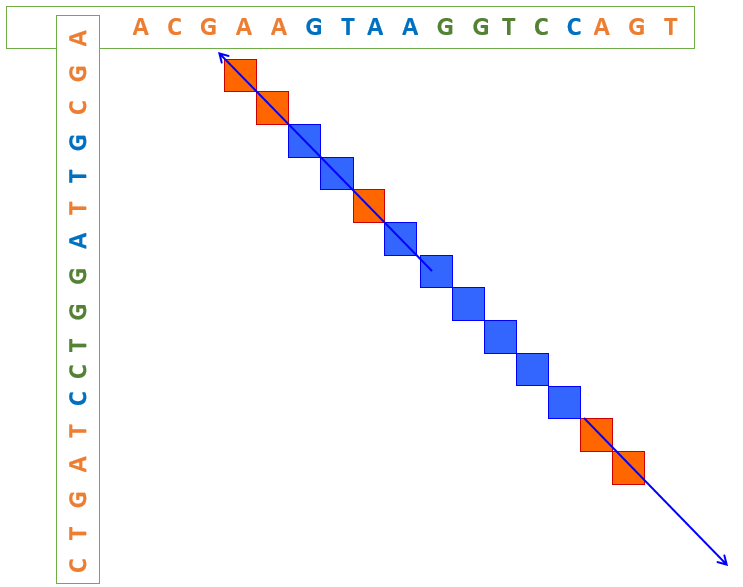
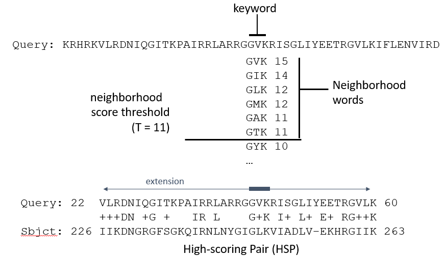

---
author:
- Blast
theme: Boadilla
title: Algoritmos para Análise de Sequências Biológicas
header-includes:
  - \hypersetup{colorlinks=true,urlcolor = blue, linkcolor=cyan,pdfborderstyle={/S/U/W 1}}
  - \AtBeginDocument{\title[AASB]{Algoritmos para Análise de Sequências Biológicas}}
  - \AtBeginDocument{\renewenvironment{Shaded} {\footnotesize} {}}
---

# Sumário
- Algoritmos e ferramentas para procurar sequências similares em bases de dados de grande dimensão
- Descrever o algoritmo Blast
- Descrever, analisar e implementar uma simplificação do Blast

# Métodos heurísticos
- **Não** garantem solução óptima.
- São **mais rápidos** que os algoritmos de PD, na ordem das 50-100 vezes.
- Se as sequências a comparar forem pouco similares, o ideal será utilizar a PD pois tem maior sensibilidade.
- Ideais para procuras em BDs, onde se tem uma sequência e se procuram sequências similares em conjuntos de elevada cardinalidade.
- Métodos mais conhecidos: FASTA e BLAST.

# Critérios de avaliação
Sensibilidade
 : % das sequências homólogas na BD que são retornadas

Precisão
 : % das sequências similares retornadas que são homólogas

Eficiência
 : tempo de resposta a um pedido

VP
 : verdadeiros positivos (sequências homólogas efetivamente detetadas)

FP
 : falsos positivos (sequências detectadas que não são homólogas)

FN
 : falsos negativos (sequências homólogas não detetadas)


$$Sensibilidade = \frac{VP}{FN + VP}$$

$$Precisão = {VP}{VP + FP}$$


# BLAST – Basic Local Alignment Search Tool
- Algoritmo mais utilizado da atualidade na pesquisa em BDs de sequências.
- Procura bons alinhamentos locais entre uma sequência query e sequências de uma base de dados definida
- Usa pequenas “palavras” (e.g. 3 AAs ou 5-15 bases de DNA);
- Procura palavras do mesmo tamanho nas sequências da BD, que comparadas com as palavras da sequência query tenham alta similaridade.
- Os matches comuns formam a base de um alinhamento local que é posteriormente estendido nas duas direções
- A extensão ocorre até o alinhamento baixar de um score pré-definido 

# Fases do Blast
1. Remover zonas de pouca complexidade (e.g. repetições) que podem comprometer o alinhamento
1. Obter todas as palavras de tamanho *w* da query
1. Para cada palavra, compilar lista de todas as palavras possíveis de tamanho *w* cujos scores, sejam maiores do que um dado limite *T* (e.g. para proteínas tipicamente *T* = 13)
1. Organizar as palavras identificadas de forma eficiente numa árvore de procura
1. Procurar em cada sequência da BD todos os hits com as palavras recolhidas
1. Estender os hits obtidos no passo 5 em ambas as direções enquanto o score for aumentando (ou mantendo-se acima de um dado limite)
1. Escolher os alinhamentos de 6 com maior score normalizando para o seu tamanho (high scoring pairs - HSPs)
1. Calcular a significância dos melhores HSPs (calculando E-value)

# Exemplo
::: {.columns}
:::: {.column width=30%}
## Procedimento
w
 : 4

match
 : GGTC

Estender diagonais com mismatches até 50%

## Resultado
GTAA**GGTC**C

GTTA**GGTC**C

::::
:::: {.column width=70%}

::::
:::

# Exemplo com proteínas


# Refinamentos
- Dois hits próximos independentes acima de *T*, separados por uma distância não superior a um parâmetro dado 
- Isto leva a menos extensões e logo a mais rapidez no algoritmo; resultados obtidos não pioram
- Esta estratégia permite incluir gaps na zona estendida entre os dois hits
- Diminuir os valores dos parâmetros *w* e *T* pode aumentar a sensibilidade mas também aumentam o tempo de processamento
- Outra melhoria: vários HSPs podem ser combinados para gerar alinhamentos maiores e de melhor qualidade; algoritmos de PD podem ser usados nesta tarefa

# Significância estatística do alinhamento
- Funções de mérito dão resultados **relativos** que não servem para avaliar a qualidade do alinhamento e a similaridade das sequências.
- Programas anteriores calculam **medidas estatísticas** para dar indicações sobre a qualidade dos alinhamentos.
- Medida mais importante: **E** – indica o nº de HSPs com o mesmo score esperado usando uma quantidade de sequências aleatórias igual ao tamanho da BD.
- Valores de E muito **próximos de zero** indicam grande similaridade. 
- Valores de E significativos tipicamente < 0,05.
- Para valores pequenos o valor de E é semelhante ao p-value
- E = 1, significa que um match aleatório terá score similar ao obtido

# Versão simplificada
- Considera apenas matches perfeitos entre a query e as sequências da BD
- Critérios simples usados para a extensão dos hits
- Score será a contagem do nº de matches

# Exercício
1. Crie uma função chamada ```query_map``` que recebe a sequência e o ```w``` e que devolve um dicionário em que as chaves são as sequências e os valores são uma lista dos índices
1. Crie uma função chamada ```hits``` que recebe o dicionário da função anterior e uma sequência da BD e devolve uma lista de *hits* em que cada elemento é um tuplo com os índices 
1. Crie uma função chamada ```extend_hit``` que recebe a query, a sequência da BD, o hit e o valor de *w* e o estende um hit em cada direção se o nº de matches for de pelo menos metade do tamanho da extensão; a função devolve um tuplo com o índice do início do hit estendido na query, na sequência, o tamanho e o nº de matches
1. Crie uma função chamada ```best_hit``` que recebe uma query, uma sequência da BD e o ```w``` e que devolve a extensão de maior score (no caso de empate, deverá devolver a de menor tamanho que aparece primeiro)

# Exemplo
~~~{.python}
>>> query = "AATATAT"
>>> seq = "AATATGTTATATAATAATATTT"
>>> w = 3
>>> qm = query_map(query, w)
>>> qm
{'AAT': [0], 'ATA': [1, 3], 'TAT': [2, 4]}
>>> hits(qm, seq)
[(0, 0), (0, 12), (0, 15), (1, 1), (1, 8), (1, 10), (1, 13), (1, 16),
 (3, 1), (3, 8), (3, 10), (3, 13), (3, 16), (2, 2), (2, 7), (2, 9),
 (2, 17), (4, 2), (4, 7), (4, 9), (4, 17)]
>>> extend_hit(query, seq, (1, 16), 3)
(0, 15, 7, 6)
>>> best_hit(query, seq, 3)
(0, 0, 7, 6)
~~~

# Sugestões
- Crie uma função auxiliar que devolva todos os índices das ocorrências de uma substring numa string
- Crie uma função auxiliar que estenda para a direita ou a esquerda quando recebe o valor +1 ou -1 respetivamente
- [Pretty printing](https://docs.python.org/3/library/pprint.html) is your friend!
- Aprenda a usar o debugger que ver com o Python, o [PDB](https://docs.python.org/3/library/pdb.html)

# Exercício
5. Crie uma classe chamada ```SimpleBlast```
1. Construtor recebe uma lista de sequências ou um ficheiro com sequências e o ```w```
1. Crie uma classe chamada ``SimpleBlastHit``` para encapsular os hits do Blast
1. Crie uma classe chamada ``SimpleBlastMatch``` para encapsular os matches do Blast
1. Crie um método chamado ```best_alignment``` que recebe a sequência de query e devolve a sequência da BD que corresponde ao maior match

# Sugestões de melhoria
- Implemente uma versão que considere uma matriz de substituição. Nesse caso, deverá definir um parâmetro T e considerar os hits de tamanho W e score >= T (poderá alterar o mapeamento da query para testar todas as hipóteses ou apenas a função hits)
- Na extensão dos hits, poderá considerar como critério estender enquanto a contribuição for positiva ou nula
- Poderá ainda implementar formas de normalizar o score considerando o tamanho do alinhamento, bem como uma função para poder ligar dois hits que tenham distâncias entre si pequenas (abaixo de um valor definido como parâmetro)
