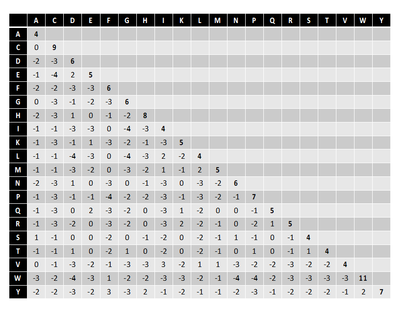

---
author:
- Alinhamentos de sequências
theme: Boadilla
title: Algoritmos para Análise de Sequências Biológicas
header-includes:
  - \hypersetup{colorlinks=true,urlcolor = blue, linkcolor=cyan,pdfborderstyle={/S/U/W 1}}
  - \AtBeginDocument{\title[AASB]{Algoritmos para Análise de Sequências Biológicas}}
---

# Sumário
- alinhmamento de sequências
- matrizes de substituição
- matrizes de pontos

# Razões para alinhar sequências
- Há muitas sequências para as quais a estrutura/função não é conhecida;
- Um bom alinhamento de duas sequências implica que estas são similares e que poderão ter uma ascendência comum;
- Duas sequências similares têm uma probabilidade mais alta de terem estruturas e funções semelhantes;
- Obtemos informações valiosas ao alinharmos uma sequência com outra cuja função/estrutura é conhecida;

# Alinhamento e similaridade
- Alinhamento de sequências: procedimento de comparação de duas ou mais sequências, procurando séries de caracteres individuais que se encontrem na mesma ordem nas sequências.
- Sequências são **similares** se número de caracteres idênticos (emparelhados durante o alinhamento) é elevado. 
- Não é possível comparar sequências biológicas sem realizar o seu alinhamento dada a existência de mutações de inserção/remoção

# Exemplos de alinhamentos
## DNA/RNA
	- C A G T G C A T G - A C A T A
	  | | |   | |   |     | | |   |
	T C A G - G C – T C T A C A G A

## Proteínas
	L G P S S G C A S R I W T K S A
	  | | |   |     |   | | | | |
	T G P S - G - - S - I W S K S G

# Tipos de alinhamento
::: {.columns}
:::: {.column width=42%}
## Globais
- Tentam-se alinhar ambas as sequências na totalidade
- Podem identificar genes/proteínas com estruturas globais e funções semelhantes  
::::
::::  {.column width=55%}
## Globais
	L G P S S G C A S R I W T K S A
	  | | |   |     |   | | | | |
	T G P S - G - - S - I W S K S G
::::
:::
::: {.columns}
::::  {.column width=42%}
## Locais
- Tentam-se alinhar segmentos das sequências
- Podem identificar zonas conservadas ao longo da evolução, e.g., zonas funcionais ativas de proteínas
::::
:::: {.column width=55%}
## Locais
	L G P S S G C A S R I W T K S A
	          | | | | | | |
	T W N R - G C A S R I W M R D W
::::
:::

# Problema de otimização
Função de mérito
 : avalia cada alinhamento possível

Alinhamento de duas sequências
 : Procura pelo melhor emparelhamento de caracteres entre duas sequências

Problema de optimização
 : pretende-se descobrir a melhor solução de entre um universo de possíveis soluções

# Formulação
## Dados
- Duas **sequências** (e.g. proteínas, DNA)
- **Função objetivo** que permite avaliar cada possível alinhamento.

## Retornar
**Emparelhamento óptimo** entre as duas sequências, retendo a ordem relativa dos elementos de cada sequência, podendo introduzir-se **espaçamentos** em cada uma delas, **maximizando a função objetivo**

# Universo de procura de soluções

## Alinhamento entre sequências de tamanho **n** com espamentos
$$\binom{2n}{n} = \frac{(2n)!}{(n!)^{2}} \approx \frac{2^{2^n}}{\sqrt{\pi n}}$$

## Progressão
  N    Combinações
---  -------------
  5            252
 10         184756
 15      155117520
 20   137846528820

# Funções objetivo
- Atribuem um valor numérico à *qualidade* de um alinhamento
- Medem a similaridade entre as duas sequências, dado o alinhamento
- Possibilidade mais simples: contar número de caracteres idênticos nas duas sequências, posição a posição.

# Funções objetivo
Normalmente aditiva, i.e., soma dos termos associados a cada par de caracteres ou espaçamentos, definida por:

- **Matriz de substituição** para a co-ocorrência de caracteres;
- Função de **penalização** para a ocorrência de espaçamentos. 

A escolha destes parâmetros influencia fortemente o resultado do alinhamento. 

# Matrizes de substituição
- Atribuem uma pontuação à substituição de um caratere numa string pelo caratere na outra
- Calculadas considerando as probabilidades de substituição de um aminoácido por um outro em sequências relacionadas
- Probabilidades são estimadas por frequências relativas de substituição, calculadas a partir de BDs biológicas
- Valores correspondem ao logaritmo da divisão das probabilidades de substituição em sequências relacionadas, sobre a probabilidade de substituição em sequências não relacionadas (logaritmos tornam coerente a sua soma na função objetivo; valores são multiplicados por 10 e arredondados)

# Exemplo
## em 1000 sequências
S
 : probabilidade de 10%

L
 : probabilidade de 15%

Par  Esperado                             Ocorrências      Score
--- -----------------------------------  -------------  -----------------
SS  $10\% \times 10\% \times 1000 = 10$  32             $10 \times log_{10}(32/10)=5$
SL  $15\% \times 10\% \times 1000 = 15$  9              $10 \times log_{10}(9/15)=-2$
LL  $15\% \times 15\% \times 1000 = 22$  22             $10 \times log_{10}(22/22)=0$

# Matrizes BLOSUM
- Valores das probabilidades são baseados em AAs pertencentes a **regiões conservadas** (blocks) em famílias de proteínas (provenientes da BD Prosite).

- Família de matrizes, em que a matriz BLOSUMi corresponde a matrizes calculadas para sequências com similaridades previstas de i%.

# Matriz BlOSUM62
{width=80%}

# Penalizações por espaçamentos
## Modelo simples
$$P = g \times x$$

## Modelos mais utilizado
Distingue entre o início de um espaçamento e a sua extensão (affine gap penalty):

$$P = g + r \times x$$

P
 : penalidade do espaçamento

g
 : penalidade por início de um espaçamento

r
 : penalidade pela extensão de um espaçamento

x
 : número de caracteres do espaçamento

## Valores típicos
g
 : entre -8 e -14;

r
 : entre -2 e -4.

# Exemplo: penalização constante
## Alinhamento
	L G P S - G C A S G I W T K S A
	  | | |   |     |   | | | | |
	Y G P S G G - - S R I W S K S G

## Parâmetros
Matriz
 : BLOSUM62

g
 : -8

## Score
$$-1 + 6 + 7 + 4 -8 + 6 -8 - 8 + 4 - 2 + 4 + 11 + 5 + 5 + 4 + 0 = 29$$

# Exemplo: affine gap penalties
## Alinhamento
	L G P S - G C A S G I W T K S A
	  | | |   |     |   | | | | |
	Y G P S G G - - S R I W S K S G

## Parâmetros
Matriz
 : BLOSUM62

g
 : -12

r
 : -2

## Score
$$-1 + 6 + 7 + 4 -12 + 6 -12 - 2 + 4 - 2 + 4 + 11 + 5 + 5 + 4 + 0 = 27$$

# Métodos para alinhamentos
## Matrizes de pontos
análise e alinhamento visuais

## Programação dinâmica – métodos exatos que garantem solução ótima:
Needleman / Wunsch
 : alinhamentos globais

Smith / Waterman
 : alinhamentos locais

## Métodos heurísticos
- mais rápidos;
- menos precisos;
- usados essencialmente para procura de sequências similares em bases de dados de grandes dimensões

- FASTA
- BLAST

# Matrizes de pontos
- Método para comparar duas sequências de forma visual, o que permite procurar zonas de alinhamento e repetições de carateres (diretas ou invertidas), para além de zonas complementares.

- Representa as duas sequências, uma na horizontal (colunas) e a outra na vertical (linhas).

- Pontos representam carateres coincidentes.

- Diagonais representam regiões de similaridade nas duas sequências.

# Matrizes de pontos: filtragem
- Para filtrar caracteres coincidentes por pura aleatoriedade, usa-se uma janela deslizante
- Ponto colocado se pelo menos *S* carateres numa janela de tamanho *W* à volta são coincidentes

## Parâmetros
W
 : window size

S
 : stringency

## Valores comuns W/S
DNA
 :  11/ 7 ou 15/ 10

Proteínas
 : 2/ 1 ou 3/ 2

# Matrizes de pontos: repetições
- Repetições causam problemas aos algoritmos de alinhamento
- Representa-se a matriz de pontos de uma sequência versus si própria
- Repetições identificadas por diagonais (que não a principal)
- Podem analisar-se as repetições variando os parâmetros de filtragem
- Repetições de uma única letra – linhas horizontais e verticais; quadrados

