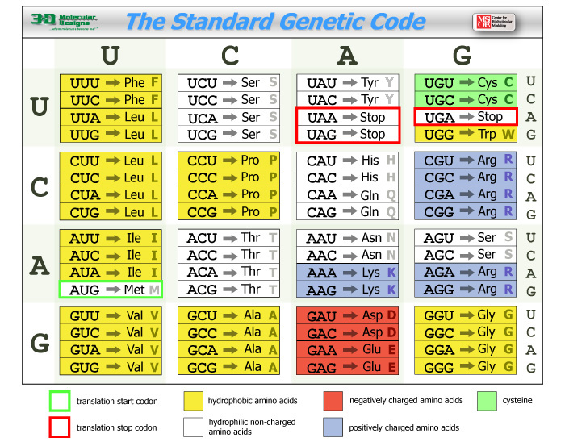

---
author:
- Ficha 3
theme: Boadilla
title: Algoritmos para Análise de Sequências Biológicas
header-includes:
  - \hypersetup{colorlinks=true,urlcolor = blue, linkcolor=cyan,pdfborderstyle={/S/U/W 1}}
  - \AtBeginDocument{\title[AASB]{Algoritmos para Análise de Sequências Biológicas}}
---

# Objetivo
- Dogma central
- Tradução
- Reading frames
- Listas

# Dogma Central
## Dogma central
	DNA => RNA => Aminoácidos

## DNA => RNA
Transformar T em U

## DNA => Aminoácidos
- Agrupar 3 a 3
- Usar a tabela de tradução para transformar o codão no aminoácido correspondente

## Proteínas
- Começa por um codão **M**
- Acaba por um codão de **Stop**
- Não pode conter codões de **Stop**

# Tabela de Conversão

{height="80%" width="80%"}

# Listas
## Características
- Objeto com vários métodos

## Métodos
append
 : Permite adicionar um elemento no fim

count
 : conta o nº de ocorrências de um elemento

index
 : Devolve o 1º índice de um elemento ou -1

pop
 : Remove um elmento por índice (por omissão o último)

## Operadores
`+`
 : Concatenação

in
 : verifica se uma string está contida noutra

[]
 : índices sobre strings

# Listas
## Percorrer listas
	for elt in lista:
		fazer algo com o elt

## Percorrer listas por índice
	for idx in range(len(lista)):
		fazer algo com lista[idx]

## Percorrer listas por índice e valor
	for idx, elt in enumerate(lista):
		podemos usar o índice idx e o valor elt

# Exemplos
```
>>> seq = "ACCTTGCA"
>>> l = []
>>> for x in seq:
...     l.append(x)
>>> l
['A', 'C', 'C', 'T', 'T', 'G', 'C', 'A']
>>> for i in range(0, len(seq), 3): print(seq[i : i + 3])
... 
ACC
TTG
CA
```

# Exercícios
## Sugestões
- Os resultados devem ser sempre em maiúsculas
- Reutilize funções
- Crie funções auxiliares onde faça sentido
- Conceito avançado e poderoso: [listas por compreensão](https://docs.python.org/3/tutorial/datastructures.html#list-comprehensions)

# Exercícios
## Exercícios
1. Escreva a função ```get_codons(dna)``` que recebe uma sequência de DNA e devolve uma lista de codões
1. Escreva a função ```codon_to_amino(codons)``` que recebe a lista de codões e devolve a sequência de aminoácidos (use _ para o codão de **Stop**)
1. Escreva a função ```get_prots(amino)``` que recebe uma sequência de aminoácidos e devolve uma lista de possíveis proteínas
1. Escreva a função ```get_orfs(dna)``` que recebe uma sequência de DNA e devolve uma lista com  as seis ORFs
1. Escreva a função ```get_all_prots(dna)``` que recebe uma sequência de DNA e devolve a lista com todas as proteínas

# Exemplos de listas por compreensão
## Carateres que não são bases de DNA
	[x for x in dna.upper() if x not in 'ACGT']
## Tradução numa linha
	[codon_to_amino(cod) for cod in get_codons(dna)]
## Todas as proteínas
	[prot for orf in get_orfs(dna) for prot in get_prots(orf)]
