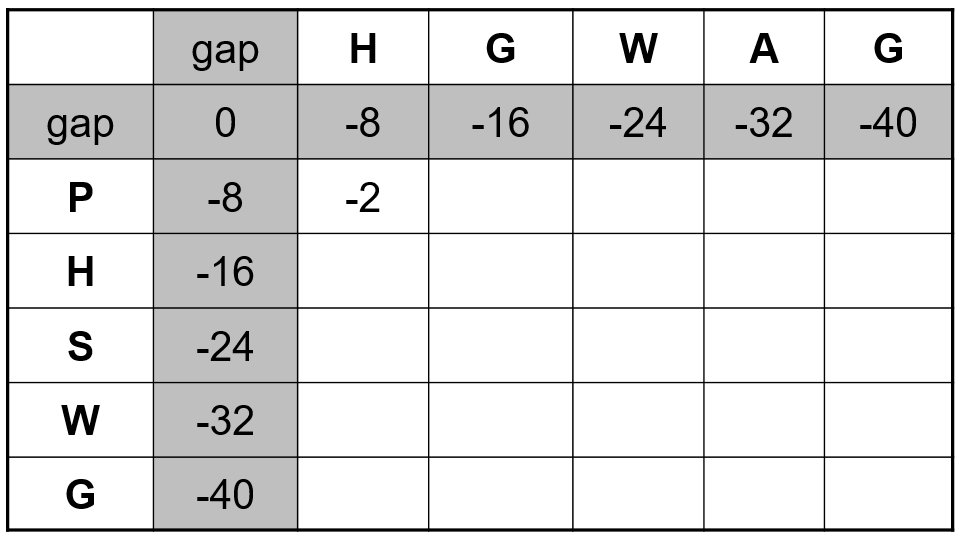
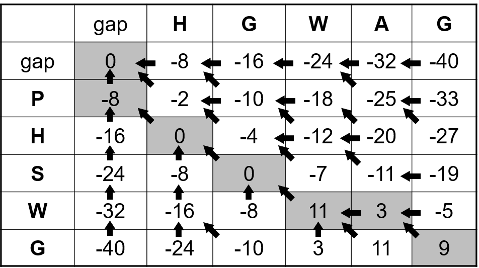
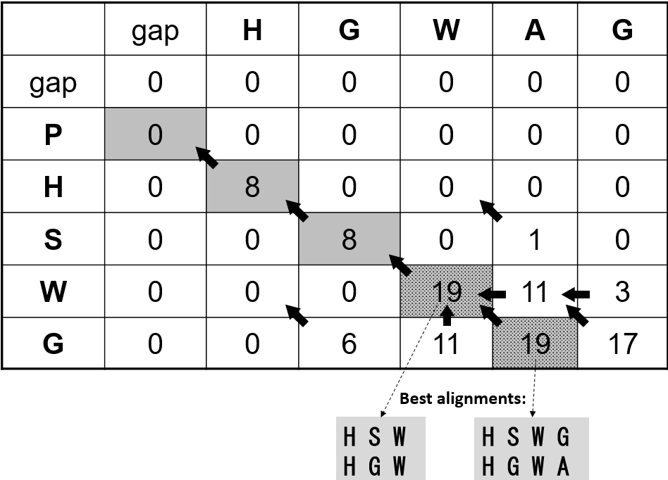

---
author:
- Alinhamento de sequências parte II
theme: Boadilla
title: Algoritmos para Análise de Sequências Biológicas
header-includes:
  - \hypersetup{colorlinks=true,urlcolor = blue, linkcolor=cyan,pdfborderstyle={/S/U/W 1}}
  - \AtBeginDocument{\title[AASB]{Algoritmos para Análise de Sequências Biológicas}}
---

# Sumário
- programação dinâmica
- algoritmo Needleman Wunsch
- algoritmo Smith Waterman

# Alinhamento global
## Conceito
- Algoritmo recursivo
- Novo alinhamento = Alinhamento anterior + ótimo local

## Alternativas do ótimo local
1. Substituir o último caratere em **s1** pelo último caratere de **s2**
1. Inserir um espaçamento em s2
1. Inserir um espaçamento em s1

## Algoritmo global
	def score(s1, s2, g = -8):
		if s1 and s2: 
			return max(
				score(s1[:-1], s2[:-1]) + subst(s1[-1], s2[-1]),
				score(s1[:-1], s2) + g,
				score(s1, s2[:-1]) + g)
		else: return max(len(s1), len(s2)) * g

# Exemplo
	>>> score("HGWAG","PHSWG")
	9

# Problemas do algoritmo recursivo
- Muito ineficiente
- O mesmo subproblema é calculado muitas vezes

## score("HGWAG","PHSWG")

 s1_s2   Contagem
------- ----------
_P       450
H_       450
H_P      321
_        321
_PH      170
HG_      170
H_PH     129
HG_P     129

# Programação dinâmica
- Não recalcula o mesmo subproblema
- Armazena todos os subproblemas numa estrutura de dados
- Conceito chama-se *memoizing*

# Memoizing
- Cria-se uma matriz **M**

	nº de colunas
	 : tamanho de **s1** + 1

	nº de linhas
	 : tamanho de **s2** + 1
- Primeira linha e coluna corresponde a gaps
- Cada célula corresponde a um subproblema
- **M[i][j]** corresponde a alinhar **s1[:i]** com **s2[:j]**

# Needleman Wunsch
{width=90%}

$$
\begin{aligned}
M[1][1] &= max(M[0][0] + subst('P', 'H'), M[1][0] - 8, M[0][1] - 8)\\
&= max(0 - 2, -8 - 8, -8 - 8) = -2
\end{aligned}
$$

# Needleman Wunsch
- Mérito do **melhor alinhamento** é dado pela célula do canto inferior direito
- Para reconstruir o alinhamento, é necessário armazenar as opções utilizadas em cada célula
- Reconstrução do alinhamento faz-se de forma inversa

# Needleman Wunsch
{width=90%}

	P H S W – G 
	- H G W A G
# Alinhamento local Smith Waterman
- Não há valores negativos na matriz
- Todos os valores negativos são substituidos por zero
- Score corresponde ao maior valor encontrado na matriz
- A reconstrução usa a matriz de trace e para quando se encontra o primeiro zero

# Smith Waterman
	M[i, j] = max(
		M[i - 1][j - 1] + subst(s1[i - 1], s2[j - 1]),
		M[i - 1][j    ] + g,
		M[i    ][j - 1] + g,
		0)

# Smith Waterman
{width=90%}
