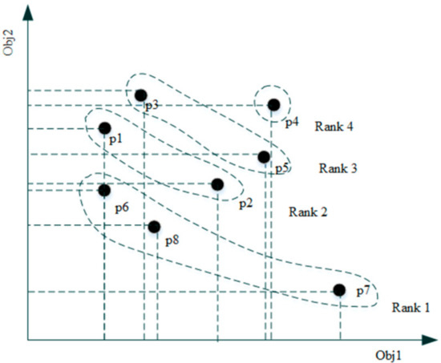
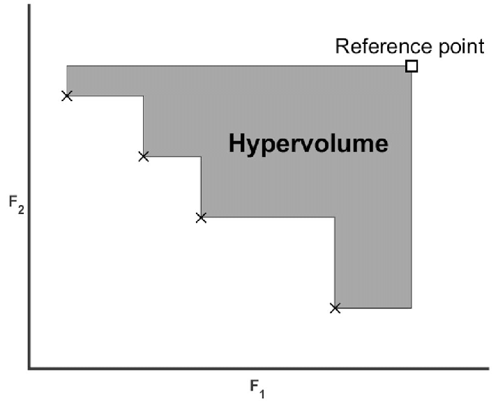

---
author:
- Rui Mendes
theme: Boadilla
title: Multi Objective Optimization
nocite: '@*'
biblio-title: References
---

[//]: # (
pandoc -t beamer -H latex_preamble.tex -s --bibliography empower.bib --filter pandoc-citeproc EmpowerSearch.md  -o EmpowerSearch.tex
)

# Rationale behind Multi-Objective Optimization
- Real world problems may have several objectives
- These are often contradictory:
	- Accuracy in a machine learning task versus the complexity of the model
	- Time needed to perform a given task versus its cost
	- Performance versus fuel consumption and emission of polluants
- In non-trivial problems, it is not possible to satisfy all objectives at the same time
 
# Multi-Objective Optimization
\begin{align*}
\textrm{Minimize/Maximize} \;\;\;\;	& f_m(x)						& m \in \{1, \ldots, M\}\\
\textrm{Subject to} \;\;\;\;		& g_j(x) \ge 0					& j \in \{1, \ldots, J\}\\
									& h_k(x) = 0					& k \in \{1, \ldots, K\}\\
									& x_i^L \le x_i \le x_i^U		& i \in \{1, \ldots, N\}
\end{align*}

# Approaches for MOPs
- Penalty weights
- Objective sorting
- Pareto approaches

# Penalty weight approaches
- Fitness function combines all objectives
- Objectives are multiplied by weights
- Decision maker (DM) must estimate the correct weights for each objective
- If DM wants several trade-offs, she must run the optimization algorithm several times with different weights
- Best way of assigning weights for each objective is not trivial

# Objective sorting
- Objectives must be ranked in order of importance
- Solutions are sorted according to the objectives
- The lexicographic order is used
- It is also difficult to find several trade-offs

# Pareto approach
- Provides many solutions at the same time
- Solutions can have high quality in one of the objectives while having lower quality in others
- Allows the DM to select any trade-off solution
- Population holds solutions according to Pareto dominance

# Pareto Dominance
Assuming minimization of all objectives

\begin{align*}
\begin{array}{r c l}
\textrm{strictly dominates}  & x \prec \prec y     & \iff   f_m(x) < f_m(y) \; \forall m \\
\textrm{dominates}           & x \prec y           & \iff   f_m(x) \le f_m(y) \; \forall m \wedge \exists i : f_i(x) < f_i(y)\\
\textrm{weakly dominates}    & x \preceq y         & \iff   f_m(x) \le f_m(y) \; \forall m \\
\textrm{incomparable}        & x \parallel y       & \iff   \neg (x \preceq y) \wedge \neg (y \preceq x)\\
\textrm{indifferent}         & x \sim y            & \iff   f_m(x) = f_m(y) \; \forall m \\
\end{array}
\end{align*}

# Pareto Store and Pareto Front
::: columns
:::: column
- A Pareto store holds non-dominated solutions
- Figure shows a Pareto set in a two objective minimization problem
- The red points belong to the Pareto front
::::
:::: column
\begin{figure}
\centering
\begin{tikzpicture}[
    point/.style={circle, draw, thin, inner sep=0.2ex}
]

\draw[->, thick] (-0.5,-0.5)--(2.4,-0.5) node[right]{$f_1$};
\draw[->, thick] (-0.5,-0.5)--(-0.5,2.4) node[above]{$f_2$};

\node[point, ball color=red]   (-1) at (2 - 0.0, 2 - 2.0) {};
\node[point, ball color=red]    (0) at (2 - 0.5, 2 - 1.8) {};
\node[point, ball color=red]    (1) at (2 - 0.7, 2 - 1.5) {};
\node[point, ball color=red]    (2) at (2 - 0.9, 2 - 1.2) {};
\node[point, ball color=red]    (3) at (2 - 1.1, 2 - 1.1) {};
\node[point, ball color=red]    (4) at (2 - 1.3, 2 - 1.0) {};
\node[point, ball color=red]    (5) at (2 - 1.5, 2 - 0.8) {};
\node[point, ball color=red]    (6) at (2 - 1.7, 2 - 0.6) {};
\node[point, ball color=red]    (7) at (2 - 1.8, 2 - 0.1) {};
\node[point, ball color=white]  (8) at (2 - 0.1, 2 - 0.8) {};
\node[point, ball color=white]  (9) at (2 - 0.2, 2 - 0.2) {};
\node[point, ball color=white] (10) at (2 - 0.2, 2 - 1.5) {};
\node[point, ball color=white] (11) at (2 - 0.3, 2 - 0.4) {};
\node[point, ball color=white] (12) at (2 - 0.3, 2 - 1.2) {};
\node[point, ball color=white] (13) at (2 - 0.3, 2 - 1.7) {};
\node[point, ball color=white] (14) at (2 - 0.5, 2 - 1.3) {};
\node[point, ball color=white] (15) at (2 - 0.6, 2 - 0.4) {};
\node[point, ball color=white] (16) at (2 - 0.7, 2 - 1.3) {};
\node[point, ball color=white] (17) at (2 - 1.3, 2 - 0.1) {};
\node[point, ball color=white] (18) at (2 - 1.3, 2 - 0.7) {};
\node[point, ball color=white] (19) at (2 - 1.5, 2 - 0.3) {};
\node[point, ball color=white] (20) at (2 - 0.9, 2 - 0.3) {};
\node[point, ball color=white] (21) at (2 - 0.7, 2 - 0.7) {};
\node[point, ball color=white] (22) at (2 - 1.0, 2 - 0.9) {};
\node[point, ball color=white] (23) at (2 - 1.1, 2 - 0.6) {};
\node[point, ball color=white] (24) at (2 - 0.5, 2 - 0.9) {};

    \draw (-1) -- (0) -- (1) -- (2) -- (3) -- (4) -- (5) -- (6) -- (7);
    
\end{tikzpicture}
\end{figure}
::::
:::

# Pareto Front and Archive

Pareto Set
: Set of non-dominated solutions in **decision space**

Pareto Front
: Set of non-dominated solutions in **objective space**

Pareto Archive
: Stores all non-domination solutions found so far

# Managing a Pareto Archive
## Adding to the archive
- Add new solutions to the archive if
- They are not dominated by any solution in it

## Cleaning archive
- When adding a new solution
- Remove all solutions dominated by it

## Pruning
- If the archive exceeds its max size
- Remove solutions from the most **crowded** regions

# Characteristics of Good algorithms
Closeness
 : Solutions should be as __close__ as possible to the true Pareto front. This gives a high quality information to the decision maker.

Even distribution
 : Solutions should be equidistant. This gives the decision maker a wider range of trade-offs from which perform the final choice.
 
High spread
 : Distance between extremes in objective space should be as high as possible. This ensures a good coverage of the Pareto Front.

# Ways of achieving these characteristics
Elitism
 : Ensure that solutions closest to the true Pareto front are never eliminated
 : The number of non-dominated solutions should increase in the population

Crowding
 : Measure that penalizes solutions that are close to each other

# Evaluation
- Based on dominance
- Uses a _Pareto-rank_: number of individuals in the population that are dominated by this individual
- Ordering often uses a secondary fitness to have a total order
- Evaluation is performed in _objective space_

# Non-dominated Sorting Genetic Algorithm (NSGA-II)

Fast Non-Dominated Sorting
 : An efficient $O(MN^2)$ method for ranking the population based on dominance.

Crowding Distance
 : A mechanism to maintain diversity along the Pareto Front without extra parameters.

Elitism
 : Guarantees that the best solutions found are never lost.

# Fast sorting
- Find all non-dominated solutions (Rank 1)
- Temporarily remove them from the population
- All currently non-dominated solutions are assigned to the next rank (Rank 2)
- The procedure is iterated

\centering

{ width=200px }

# Crowind distance
- Used for solutions on the *same* rank
- Perimeter of the *cuboid* formed by its nearest neighbors on either side
- Sum the distance from current solution to the nearest neighbors (e.g., $|f_1(i+1) - f_1(i-1)|$ ) on each objective
- Prefer solutions with the largest crowding distance

# The NSGA-II Algorithm
- Pareto store holds several layered fronts
- First layer $F_1$ only holds non-dominated individuals
- Individuals belonging to front $F_{i+1}$:
	- can only be dominated by individuals in front $F_i$ or lower
	- are non-dominated by all individuals not belonging to $\bigcup\limits_{k \le i} F_{i}$
- Fitness rank of individuals in front $F_i$ is $i$
- _Crowding distance_, how close a solution is to its neighbors, in objective space, is calculated for each individual
- Individuals are ordered first by the _fitness rank_ and then by the _crowding distance_
- Parents are selected by binary tournament selection based on their _rank_ and _crowding distance_
- They create offspring using crossover and mutation
- Uses a $(\mu + \lambda)$-ES selection scheme

# Strength Pareto Evolutionary Algorithm 2 (SPEA2)

Fixed-Size External Archive
 : Keeps all non-dominated solutions found so far, up to a limit.

Strength Fitness
 : Fitness calculation is based on how many solutions a candidate dominates and how many dominate it.

Density Estimation
 : Uses the $k$-th nearest neighbor distance to ensure diversity during archive maintenance.

# Strength Fitness

SPEA2 assigns fitness based on two properties derived from dominance:

1. Strength Value $S(i)$

    The **Strength** of a solution $i$ is the number of solutions it **dominates** in the combined population (main population + archive).
    Solutions with higher strength are generally better candidates.

2. Raw Fitness $R(i)$

    The **Raw Fitness** is the sum of the strength values of all solutions that **dominate** $i$.
    If a solution $i$ is non-dominated, $R(i)$ will be 0.
    The goal is to **minimize** Raw Fitness.

# Density Estimation

- Unlike NSGA-II's Crowding Distance, SPEA2 uses a refined density metric based on distance.

    - The **$k$-th Nearest Neighbor** method finds the distance to the $k$-th closest solution in the objective space.
    - This distance is then used to calculate the **Density Value** $D(i)$.
    - The **Overall Fitness** is $F(i) = R(i) + D(i)$, where $R(i)$ is the Raw Fitness.

- Solutions in less dense regions will have a smaller Density Value, making their overall fitness better (since $F(i)$ is minimized).

- This metric is primarily used during the **archive truncation** step to remove clustered solutions.

# Robust Archive Truncation
- Calculate the **$k$-th nearest neighbor distance** for all solutions in the archive.
- Identify the two closest solutions (smallest distance).
- Remove the solution that is **least spread out** (i.e., the one with the smallest $k$-th nearest neighbor distance).
- Repeat this removal process until the archive returns to its fixed size.

# Multi-Objective Evolutionary Algorithm based on Decomposition (MOEA/D)
- It transforms the complex multi-objective problem into many simpler, single-objective *subproblems*
- It solves them **simultaneously** and **cooperatively**

# Weight Vectors
- The problem is broken down using a set of weight vectors, $\lambda_1, \lambda_2, \ldots, \lambda_N$
- Each vector represents a different trade-off preference (e.g. $\lambda_1 = 0.1 \cdot f_1 + 0.9 \cdot f_2, \lambda_2 = 0.2 \cdot f_1 + 0.8 \cdot f_2, \ldots, \lambda_N = 0.9 \cdot f_1 + 0.1 \cdot f_2$)
- These vectors are typically spread uniformly to guide the search for an evenly distributed Pareto Front
- Each vector $\lambda_i$ is used to create one single-objective subproblem $g_i$

# Creating subproblems

## Tchebycheff

- The most common method
- Finds the solution with the smallest 'weighted distance' to an ideal reference point
- Handles non-convex fronts well.

## Weighted Sum

- A simple sum of objectives, each multiplied by its weight
- Struggles with non-convex (concave) Pareto fronts.

## PBI

- Penalty-based Boundary Intersection
- Another popular method that measures both convergence and diversity effectively

# Neighborhood

- Each subproblem $i$ has a *neighborhood*, $B(i)$
- This is the set of the $T$ closest subproblems (based on the distance between their weight vectors)
- Subproblems in a neighborhood have similar trade-offs
- Mating and replacement occurs within this neighborhood, allowing solutions to share information locally
- This is more efficient

# Algorithm

- Generate $N$ weight vectors, create $N$ subproblems, and initialize a population (one solution per subproblem)
- For each subproblem $i$, select parent solutions only from its neighborhood $B(i)$
- Create a new offspring solution $y'$ using genetic operators
- Check $y'$ against all solutions in $B(i)$. If $y'$ is better for any neighbor $j$, replace its solution $x_j$

# Neighborhood Update
- A new solution $y'$ is generated by parents from subproblem $i$'s neighborhood
- This solution $y'$ is then used to update the solutions of neighboring subproblems ($j$, $k$, etc.)
- This allows good solutions to *move* between subproblems, driving the entire population towards the Pareto Front

# Advantages of MOEA/D
Efficiency
 : Lower computational complexity per generation than many Pareto-based methods (like NSGA-II).

Diversity
 : The use of evenly spread weight vectors naturally encourages a diverse set of solutions along the Pareto Front.

Scalability
 : The framework can be adapted to handle many-objective problems (MaOPs) relatively well.

Simplicity
 : The core concept is elegant and can be combined with many different decomposition methods and operators.

# Many-Objective Problems
- Curse of dimensionality
- Pareto Dominance Fails: Almost all solutions become non-dominated.
- Crowding Distance Fails: Density is impossible to calculate in high dimensions.

# NSGA-III
- Crowiding distance from NSGA-II becomes ineffective
- It leads to poor selection pressure and loss of diversity
- NSGA-III replaces it with *Reference Points*

# Reference Points
- A set of structured reference points is generated on a normalized hyper-plane (e.g., using the *Das-Dennis* method)
- These points act as *guides* or *attractors* to maintain diversity across the entire objective space
- The algorithm's goal is to find at least one good solution close to each of these reference points

# Normalization
- Before selection, the algorithm normalizes the objective values for all solutions in the splitting front (`Fl`).
- It finds the ideal point (minimums) and extreme points (maximums) to create a normalized hyperplane.
- This ensures distances are measured on a fair, uniform scale.

# Association
- Each normalized solution (`s`) in the splitting front is "associated" with the closest reference point.
- "Closest" is measured by the perpendicular distance from the solution to the vector (line) defined by the reference point.

# Niching and Selection
- Count: The algorithm counts how many solutions are associated with each reference point (the "niche count").
- Select: To fill the remaining `K` spots in the new population, the algorithm iteratively selects solutions.
- Priority: It picks from reference points with the lowest niche count (least crowded niches).
- Diversity: This process explicitly maintains diversity by ensuring all reference points (all regions of the front) are represented.

# Advantages of NSGA-III
- Solves MaOPs: Specifically designed for problems with 4 or more objectives.
- Maintains Diversity: Reference points effectively preserve diversity across the entire Pareto front.
- Strong Selection: The niching mechanism maintains selection pressure even when most solutions are non-dominated.
- Flexible: A well-established and powerful tool for complex engineering and design problems.

# Comparing Algorithms

Convergence
 : how close is the generated front from the true pareto front?

Diversity
 : how well are the solutions spread across the front?

Combined
 : metrics that combine both convergence and diversity

# Generational Distance (GD)
- Evaluate the quality of a set of solutions
- Compares how well they converge to the true Pareto front
- Measures the average distance between each solution in the set and its closest solution in the true Pareto front

# Computing the GD

Calculate the distance
 : For each point in the obtained solution set, calculate the Euclidean distance to every point in the reference Pareto set.

Find the minimum
 : For each point from the obtained set, identify the minimum distance to any point in the reference set.

Average the minimums
 : Average these minimum distances across all points in the obtained set. This provides the final GD value.

Interpretation
 : A lower GD value means the obtained solution set is closer to the true Pareto front, indicating better performance.

# Variants and related metrics
Inverted Generational Distance (IGD)
 : A variant that uses a reference set from the true Pareto front and can be used to evaluate both convergence and diversity.

Generational Distance Plus ($GD^{+}$)
 : A variant that modifies the distance calculation to be more robust.

Spacing
 : Measures the standard deviation of the distances between consecutive solutions. A low value means solutions are evenly spaced.

Hypervolume (HV)
 : A different metric that measures the volume of the dominated space by the obtained solutions relative to a reference point, without needing a true Pareto set.

Spread
 : Another common metric that measures the spread or diversity of the obtained solutions along the Pareto front

# Hypervolume (HV)
::: columns
:::: column
- Most popular and powerful metric
- Measures the volume of the objective space that is dominated by the found pareto front, relative to a reference point
- Combines both convergence and diversity.
- Does not require the true Pareto front.
- A larger HV is better.
::::
:::: column
{ width=200px }
::::
:::

# Comparing Algorithms
- Run each algorithm a large number of times ($\ge 30$)
- Use non-parametric tests to compare the chosen metric (e.g., HV)
    - Wilcoxon Rank-Sum Test or
    - Mann-Whitney U Test
