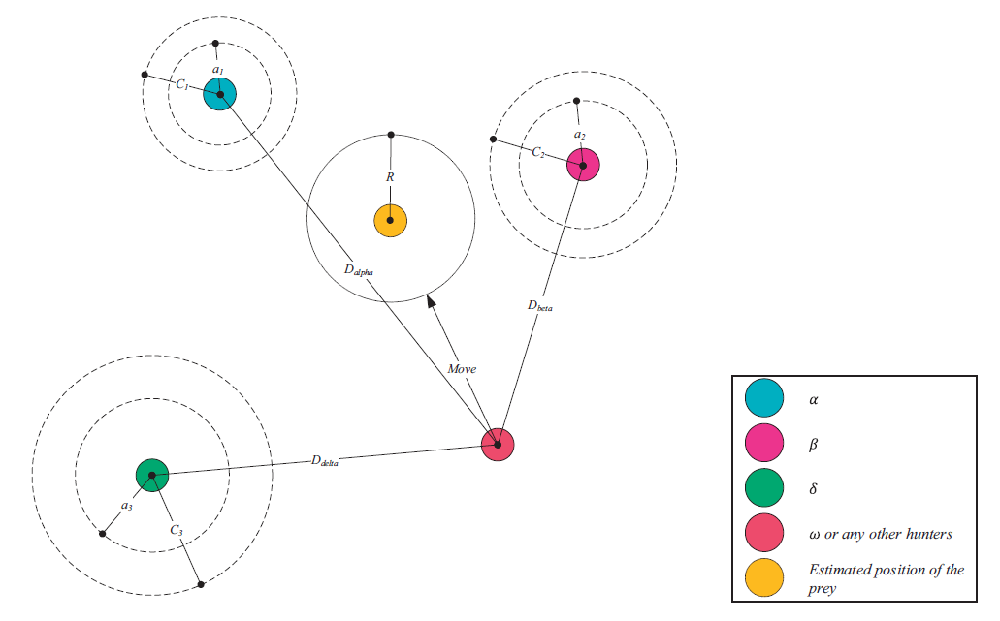

---
author:
- Rui Mendes
theme: Boadilla
title: Social Inspired Algorithms
nocite: '@*'
biblio-title: References
---

[//]: # (
pandoc -t beamer -H latex_preamble.tex -s --bibliography biblio.bib --filter pandoc-citeproc -s SocialInspiredAlgorithms.md -o SocialInspiredAlgorithms.tex
)

# Introduction
::: columns
:::: column
## Characteristics
- Inspired in social systems
- Borrows ideas from the organization of swarms, flocks, social psychology
::::
:::: column
## Examples
- Particle Swarm Optimization
- Ant Colony Optimization
- Jaya Algorithm
- Grey Wolf Optimization
- Ant Colony Optimization
::::
:::

# Concepts
- Optimization based on social interactions
- Uses population of individuals
- Most algorithms are used for real optimization
- They borrow ideas from the behavior of living systems

# Particle Swarm Optimization
- Created in 1995 by James Kennedy and Russell Eberhart 
- Inspired in social psychology and bird flock simulation
- Uses a population of individuals
- Each individual has a position and a velocity
- Velocity is updated by:
	- Atraction to the best position it found in the past
	- Attraction to the best position found by the group

# PSO General scheme
1. Initialize population
1. Evaluate individuals
1. For each individual
	1. Choose individuals from neighborhood
	1. Imitate these individuals
	1. Update best performance if a better position was found
1. Iterate to 3 until stopping criterion is found

# PSO Algorithm
## Individuals' state
Position
 : Current position $\vec x_i$

Velocity
 : Current velocity $\vec v_i$
 
Individualism
 : Previously best found position $\vec p_i$
 
Conformism
 : Previously best found position by the group $\vec p_g$

## Algorithm
\begin{eqnarray*}
\left\{
\begin{array}{l l}
\vec v_i = & \chi \; (\vec v_i + \vec{\mathrm U}[0, \varphi_1] \; (\vec p_i - \vec x_i) + \vec{\mathrm U}[0, \varphi_2] \; (\vec p_g - \vec x_i))\\
\vec x_i = & \vec x_i + \vec v_i
\end{array}
\right.
\end{eqnarray*}
 

# Initial version
- Initially, the algorithm was proposed with these equations:
\begin{eqnarray*}
\left\{
\begin{array}{l l}
\vec v_i = & \vec v_i + \vec{\mathrm U}[0, \varphi_1] \; (\vec p_i - \vec x_i) + \vec{\mathrm U}[0, \varphi_2] \; (\vec p_g - \vec x_i)\\
\vec x_i = & \vec x_i + \vec v_i
\end{array}
\right.
\label{EqFirst}
\end{eqnarray*}

# Maximum velocity
- The velocity often becomes very large
- To counter this effect, a new parameter was introduced: $V_{max}$
- This parameter prevents the velocity from becoming too large
- This parameter is usually coordinate-wise
- If it is too large, individuals fly past good solutions
- If it is too small, individuals explore too slowly and may become trapped in local optima
- Early experience showed that $\varphi_1$ and $\varphi_2$ could be set to 2 for almost all applications and only $V_{max}$ needed to be adjusted

# Innertial Weight
\begin{eqnarray*}
\left\{
\begin{array}{l l}
\vec v_i = & \alpha \; (\vec v_i + \vec{\mathrm U}[0, \varphi_1] \; (\vec p_i - \vec x_i) + \vec{\mathrm U}[0, \varphi_2] \; (\vec p_g - \vec x_i))\\
\vec x_i = & \vec x_i + \vec v_i
\end{array}
\right.
\label{EqInnertial}
\end{eqnarray*}

- $\varphi_1$ and $\varphi_2$ were usually set to $2.1$
- The $alpha$ parameter was uniformly varied between $0.9$ and $0.4$.

# Constriction Coefficient
- Clerc proposed a version similar to the innertia weight
- The coefficient has a fixed value instead of a varying one
- The theoretical study seemed to indicate that a setting of all the parameters was enough to guarantee convergence without explosion or oscillation behaviors

Parameters
 : $\varphi_1 = \varphi_2 = 2.05$, $\chi = 0.729$
 
## Algorithm
\begin{eqnarray*}
\left\{
\begin{array}{l l}
\vec v_i = & \chi \; (\vec v_i + \vec{\mathrm U}[0, \varphi_1] \; (\vec p_i - \vec x_i) + \vec{\mathrm U}[0, \varphi_2] \; (\vec p_g - \vec x_i))\\
\vec x_i = & \vec x_i + \vec v_i
\end{array}
\right.
\label{EqCanonical}
\end{eqnarray*}

# Solution Generation in PSO
\centering
{ width=70% }

# Premature Convergence in PSO
- The global best individual in the population often degrades PSO performance
- Convergence is fast
- Diversity is lost fast
- This leads to premature convergence
- It is better to use strategies to decrease the information flow

# What are the causes of premature convergence?
Optimization is a balance between two factors:

exploration
 : The ability to explore the search space to find promising areas

exploitation
 : The ability to concentrate on the promising areas of the search space

- An algorithm with too much exploration isn't \textit{efficient}
- An algorithm with too much exploitation loses \textit{diversity} fast
- If an algorithm doesn't have enough diversity, it will quickly stagnate

# Neighborhood concept
- Individuals imitate their (most successful) neighbors
- His neighbors will only influence their neighbors once they become sufficiently successful
- This favours clustering: different social neighborhoods may explore different areas of the search space
- Immediacy may be based on:

Proximity
 : Proximity in Cartesian space

Social
 : To share social bonds

# Example of Good Topologies
\centering
{ height=70% }

# Example of Good Topologies
\centering
{ height=70% }

# Discussion
- PSO is easy to implement
- The canonical version has a setting for both $\varphi_1$ and $\varphi_2$ and $chi$
- Thus, the only parameters that need to be changed are the population size and the number of function evaluations
- Any of the  population topologies given above works well

# Fully Informed Particle Swarm
## Characteristics
- All contributions of the neighborhood are used
- Individual imitates the social norm
- The social norm is the center of gravity
- $\vec p_k$ is the best position of neighbor $k$
- $\mathcal{N}$ is the set of neighbors

## Algorithm
\begin{eqnarray*}
\left\{
\begin{array}{l l}
\vec v_{t+1} = & \chi \left( \vec v_t + \frac{\sum_{k \in \mathcal{N}} \vec{\mathrm{U}}\left[0, \varphi_{max}\right] (\vec p_k - \vec x_t)}{\left\vert \mathcal{N} \right\vert} \right)\\
\vec x_{t+1} = & \vec x_t + \vec v_{t+1}
\end{array}
\right.
\label{Eq:FIPS}
\end{eqnarray*}

# Solution Generation in FIPS
\centering
{ width=70% }

# Differences between Canonical PSO and FIPS
- There is no self contribution
- All individuals in the neighborhood contribute to the influence
- The number of individuals used is very important: A few contributions, typically between 2 and 4 are best
- Given a well chosen population topology, it outperforms the canonical model
	
	
# Discussion
- FIPS is easy to implement
- It often has better performance than the canonical PSO
- Parameter settings are the same as for PSO, and thus are fixed
- Thus, the only parameters that need to be changed are the population size and the number of function evaluations
- Any of the  population topologies given above works well

# Jaya Optimization
## Characteristics
- Similar to PSO
- Fewer control parameters
- Has a component towards the best point found
- Has a component away from the worst point found
- Update is elitist (i.e., new position is only used if it is better than the current one)

## Algorithm
$x_i = x_i + \mathrm U[0, 1] \; (x_{best} - |x_i|) - \mathrm U[0, 1] \; (x_{worst} - |x_i|)$

# Discussion
- Jaya is similar to PSO
- The best and worst performers influence the search
- The only parameters that need to be changed are the population size and the number of function evaluations
- It needs further study to ascertain its performance and if the formulas can be simplified

# Grey Wolf Optimization
## Characteristics
- Idea is quite similar to FIPS
- Best three solutions ($\alpha$, $\beta$, $\delta$) found guide the search
- New positions are generated by a random combination of the three positions
- The parameter $a$ is linearly decreased from 2 to 0

## Algorithm
\begin{align*}
\vec A_k &= \vec{\mathrm U}[-a, a] &\mathrm{where}& \; k \in \{\alpha, \beta, \delta\}\\
\vec C_k &= \vec{\mathrm U}[ 0, 2] &\mathrm{where}& \; k \in \{\alpha, \beta, \delta\}\\
\vec D_k &= |\vec C_k \otimes \vec X_k - \vec X| &\mathrm{where}& \; k \in \{\alpha, \beta, \delta\}\\
\vec P_k &= \vec X_k  - \vec A_k \otimes \vec D_k &\mathrm{where}& \; k \in \{\alpha, \beta, \delta\}\\
\vec X_{t + 1} &=  \frac{\vec P_{\alpha} + \vec P_{\beta} + \vec P_{\delta}} 3
\end{align*}

# Solution Generation in GWO
\centering
{width=80%}

\tiny Figure taken from https://doi.org/10.1016/j.advengsoft.2013.12.007

# Discussion
- GWO is similar to FIPS
- The 3 best individuals guide the search
- Like FIPS, new solutions are generated by a stochastic barycenter
- The only parameters that need to be changed are the population size and the number of function evaluations
- It needs further study to ascertain its performance and if the formulas can be simplified
- It seems to only work well when the best solution is zero
- There is ongoing research for solving this tendency

# Ant Colony Optimization
- Inspired in ant foraging behavior
- Solutions are built by navigating in a graph
- A graph path represents a solution
- A path starts in the initial vertex
- In each vertex, the choice of next edge to visit is _probabilistic_
- The probability of choosing an edge depends on two criteria:
	- attractiveness
	- pheromone levels
- Initially, all graphs have the same pheromone level $\tau_0$
- After each iteration, pheromone is deposited on each edge according to the quality of the solution
- Pheromone gradually evaporates from all edges

# Edge choice

Attractiveness
 : Heuristic that determines the _a priori_ attractiveness of a given branch

Trail
 : Pheromone quantity deposited in an edge depending on the contribution of that edge in good quality solutions (_a posteriori_ contribution)

# Probability of choosing an edge
\begin{eqnarray*}
p_{uv} = \frac{\tau^\alpha_{uv} \cdot \nu^\beta_{uv}}{\sum\limits_{w \in \textrm{viz}(u)} \tau^\alpha_{uw} \cdot \nu^\beta_{uw}}
\end{eqnarray*}

where:

- $\tau$ is the pheromone value deposited in the edge and $\nu$ is the heuristic.
- $\alpha$ e $\beta$ are parameters that weigh the importance of each component.

# Pheromone update
Evaporation
 : Each branch evaporates using an evaporation coefficient $0 \le \rho < 1$

Deposit
 : Each ant deposits pheromone on the edges used in a solution proportionally to the solution quality.

\begin{align*}
\tau_{uv} = (1 - \rho) \cdot \tau_{uv} + \sum\limits_{k=1}^m\Delta^k_{\tau_{uv}}
\end{align*}

The value $\Delta^k_{\tau_{uv}}$ corresponds to the contribution of edge $uv$ to the solution found by ant $k$.

# $\mathcal{MAX}$-$\mathcal{MIN}$ Ant System
- There is a lower $\tau_{min}$ and upper $\tau_{max}$ bound for the pheromone
- Only the best ant deposits pheromone

\begin{eqnarray*}
\tau_{uv} = (1 - \rho) \cdot \tau_{uv} + \Delta_{\tau^{best}_{uv}}\\[1em]
\tau_{uv} = \left\{
\begin{array}{c c c}
\tau_{uv}   &\mathrm{if}& \tau_{min} \le \tau_{uv} \le \tau_{max}\\
\tau_{min} &\mathrm{if}& \tau_{min} > \tau_{uv}\\
\tau_{max} & \mathrm{if}& \tau_{max} < \tau_{uv}\\
\end{array}\right.
\end{eqnarray*}

In the TSP, if  $D_{best}$ is the total distance of the best solution:

\begin{eqnarray*}
\Delta_{\tau^{best}_{uv}} = \left\{
\begin{array}{c l}
1/D_{best} &\textrm{if } (u, v) \textrm{ belongs to the best path}\\
0 &\textrm{otherwise}
\end{array}\right.
\end{eqnarray*}

# Advantages of $\mathcal{MM}$AS
- Since the best ant deposits pheromone, there is a _bias_ towards higher quality solutions
- In order to control the _bias_ the  $\tau_{min}$ and $\tau_{max}$ limits guarantee that:
	- there is always a minimum probability of choosing any edge in the graph
	- the probability of choosing a highly successful edge is never bigger than a given amount

# Ant Colony System
- An _elitist_ transition is chosen with probability $q_0$
- The pheromone update method has a _global_ and _local_ components
- In the _global_ component, pheromone is deposited in the edges belonging to the best solution found thus far
- In the _local_ component, the pheromone amount of the branches used by the ants is decreased

# Ant Colony System: Transition rules

\begin{eqnarray*}
v = \left\{
\begin{array}{c c}
\operatorname*{arg\,max}\limits_{w \in \textrm{viz}(u)}\, \tau^\alpha_{uw} \cdot \nu^\beta_{uw} &\textrm{if } q \le q_0\\[1.5 em]
V &\textrm{if } q > q_0
\end{array}\right.
\end{eqnarray*}

where $0 \le q_0 \le 1$ is a probability, $q = U[0, 1]$ and $V$ is chosen probabilistically according to the rule:

\begin{eqnarray*}
p_{uv} = \frac{\tau^\alpha_{uv} \cdot \nu^\beta_{uv}}{\sum\limits_{w \in \textrm{viz}(u)} \tau^\alpha_{uw} \cdot \nu^\beta_{uw}}
\end{eqnarray*}

# Ant Colony System: pheromone update

global
 : only for the best solution found thus far
 : $\tau_{uv} = (1 - \rho) \cdot \tau_{uv} + \rho \cdot \Delta_{\tau^{best}_{uv}}$

local
 : for all solutions visited in the current iteration
 : $\tau_{uv} = (1 - \rho) \cdot \tau_{uv} + \rho \cdot \tau_0$\\[1 em]

$\tau_0$ is the initial pheromone value of all the edges in the initial iteration

# Ant Colony System: Advantages
- The transition method allows the introduction of some _elitism_ depending on the value given to $q_0$
- As in $\mathcal{MM}$AS, pheromone is only increased in the edges belonging to the _best solution_ found
- The local update _lowers the attractiveness_ of the edges traversed by the ants
- This characteristics fosters exploration

# Applications

Routing
 : Travelling salesman, vehicle routing, sequential ordering

Assignment
 : Quadratic assignment, timetables, graph coloring

Scheduling
 : Several scheduling problems

Subsets
 : Knapsacking, cliques

Bioinformatics
 : Shortest common supersequence problem, sequencing, protein folding, protein-ligand docking, haplotype inference

Others
 : Constraint satisfaction, data mining

# Using ant colonies in a problem
- Which variant to use and the parameters' values
- How to represent the solution as a graph
- How to compute the solution quality
- What heuristic to use for each edge $\nu_{uv}$
- Is it possible to use the information of the partial solution in the heuristic?
- Is it possible to use local search?

# Example: Travelling Salesman Problem
- Each ant starts in the beginning city
- The fitness function is the inverse of the total distance
- The probability of revisiting a city is zero
- The heuristic is the inverse of the distance between both cities

# Example: Constraint satisfaction
- There is a set of variables $X_1, \ldots, X_n$
- Each variable has several possible values (e.g., $X_1 \in \{x_{11}, \ldots, x_{1m}\}$)
- There are constraints $p_1, \ldots, p_r$ where each constraint is a predicate (e.g., $p_1(X_1, \ldots, X_n)$)

# Example: Constraint satisfaction
- Establish an order for the variables
- There is an initial state $S_0$
- Each vertex of the graph is a variable assigment (e.g., $X_1=x_{14}$)
- The objective function may be the number of valid constraints
- The heuristic may be the number of valid constraints after this assigment
- A solution to a problem with 3 variables could be $<S_0> \rightarrow <X_1=x_{14}> \rightarrow <X_2=x_{22}> \rightarrow <X_3=x_{31}>$

# Example: Set covering problem
- We have a finite set of elements $A = \{a_1, \ldots, a_n\}$ 
- And a set of subsets $B = \{B_1, \ldots, B_l\}$ such as  $B_i \subseteq A$ that covers A, i.e., $\bigcup\limits_{i=1}^l B_i = A$
- Each set $B_i$ has an associated cost $c_i$
- The objective of the SCP is to find a subset $C \in B$ such as:
	1. $\bigcup\limits_{B_i \in C} B_i = A$
	1. minimize $\sum\limits_{B_i \in C} c_i$

# Example: Set covering problem
- Each ant starts with the empty set and adds a set $B_i$ each time
- Only use edges that add at least one $a_j$ that is not in the current solution
- The heuristic of choosing the set $B_i$ may be:
	1. $\frac 1 {c_i}$
	1. $\frac {\left|B_i\right|}{c_i}$
	1. $\frac {d_i}{c_i}$ where $d_i$ is the number of elements of $B_i$ that are not yet covered by the current solution

- An ant finishes building the solution when it has covered the entire set $A$
- Pruning may be performed _a posteriori_ by  removing superfluos sets
- Best solutions may use local search
