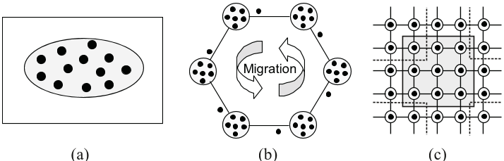

---
author:
- Rui Mendes
theme: Boadilla
title: Premature Convergence
nocite: '@*'
biblio-title: References
---

[//]: # (
pandoc -t beamer -H latex_preamble.tex -s --bibliography empower.bib --filter pandoc-citeproc EmpowerSearch.md  -o EmpowerSearch.tex
)

# Panmictic Model

- All individuals are part of a single population.
- Any individual may mate with any other, often leading to faster convergence.
- However, this increases the risk of premature convergence and loss of diversity

# Premature Convergence
- It's a common problem in optimization algorithms
- Happens when the algorithm gets stuck in a local optimum
- In GAs, this happens when there is a loss of *diversity*
- The individuals that are close to the local optimum dominate the population
- Exploration stops before finding the optimum

# Premature Convergence
- If individuals are quite similar, then crossover does not help exploration.

:::columns
::::column
## Parents
\centering
$\textcolor{blue}{010}|\textcolor{blue}{110}$

$\textcolor{red}{011}|\textcolor{red}{110}$
::::
::::column
## Offspring
\centering
$\textcolor{blue}{010}|\textcolor{blue}{110}$

$\textcolor{red}{011}|\textcolor{red}{110}$
::::
:::

# Consequences
- reduced search efficiency
- algorithm stops finding promising solutions
- poor generalization
- difficulty escaping local minima

# Causes of Premature Convergence

Loss of diversity
 : population becomes genetically uniform, leading to stagnation.

Selection pressure
 : high pressure amplifies fitter individuals quickly, spreading limited genes.

Small or panmictic populations
 : unrestricted mating causes uniformity and rapid domination of early winners.

Self-adaptive mutations
 : unless controlled carefully, they can overspecialize populations.

Inadequate mutation/crossover parameters
 : imbalance between exploitation and exploration contributes to stagnation

# Detection of Premature Convergence

- Rapid decrease in population diversity metrics.
- Fitness stagnation across generations.
- Premature plateauing of performance curves.
- Visualization tools for convergence monitoring are needed.

# Some Diversity Measures

Hamming Distance
 : Calculates the number of positions at which two chromosomes (sequences) differ.

Shannon Entropy
 : Uses information theory to measure diversity based on the frequencies of different alleles.

Variance/Standard Deviation
 : Can be used as a diversity measure, particularly for populations with real-valued genes, by measuring the spread of the population around its mean.

# How to solve premature convergence
- Adaptive mutation rates
- Fitness sharing
- Populaton structures
- Mass extinction models

# Adaptive mutation rates
- The mutation rate depends on diversity
- It is small if there is a high diversity
- It gets higher when diversity decreases

# Fitness sharing
- Also called _speciation_
- Similar individuals share their fitness
- They share a niche
- The average fitness of the individuals in each niche is calculated
- Each individual in the niche is assigned that average fitness divided by the number of individuals in the niche

# Fitness sharing and niching
Fitness sharing
 : reduces the fitness in densely populated areas
 : it divides the fitness by the number of individuals that share the same fitness

Crowding
 : a percentage of the individuals reproduce
 : they substitute the most similar individual of a random subset of the population

Deterministic crowding
 : introduces  competition  between  children and  parents  of  identical  niches
 : each child replaces the nearest parent if  it  has  a  higher  fitness
 
Restricted Tournament Selection
 : two individuals are chosen to reproduce
 : a random sample of individuals is chosen
 : each offspring competes with the closest individual
 : the winner is inserted in the new population

Clearing
 : close individuals are assigned to the same clearing
 : only the $k$ best individuals survive, the fitness of the others is reset 
 
# Population structures
There are three kinds of population structures:
- No structure (e.g., the panmictic model)
- Large granularty (e.g, the island model)
- Course granularity (e.g., the cellular model)
- Graph based structures

\centering
{width=80%}

\tiny Image taken from Design Issues in a Multiobjective Cellular Genetic Algorithm

# Island model
:::columns
::::column
- There are several subpopulations evolving in parallel
- There are some sporadic migrations of individuals among islands
- There is a distribution of the computational effort
- The diversity is higher
::::
::::column
\centering
\begin{tikzpicture}[x=0.75pt,y=0.75pt,yscale=-1,xscale=1, scale = 0.4]
%uncomment if require: \path (0,444); %set diagram left start at 0, and has height of 444

%Shape: Circle [id:dp5047982115142493] 
\draw   (253.01,237.5) .. controls (233.75,262.8) and (197.63,267.71) .. (172.33,248.45) .. controls (147.03,229.2) and (142.13,193.08) .. (161.38,167.78) .. controls (180.64,142.48) and (216.76,137.57) .. (242.06,156.83) .. controls (267.36,176.08) and (272.26,212.2) .. (253.01,237.5) -- cycle ;
%Shape: Circle [id:dp5829733482144657] 
\draw  [fill={rgb, 255:red, 12; green, 0; blue, 0 }  ,fill opacity=1 ] (180.32,180.01) .. controls (183.07,180.18) and (185.16,182.56) .. (184.99,185.32) .. controls (184.82,188.07) and (182.44,190.16) .. (179.68,189.99) .. controls (176.93,189.82) and (174.84,187.44) .. (175.01,184.68) .. controls (175.18,181.93) and (177.56,179.84) .. (180.32,180.01) -- cycle ;
%Shape: Circle [id:dp49158831858883156] 
\draw  [fill={rgb, 255:red, 12; green, 0; blue, 0 }  ,fill opacity=1 ] (178.32,222.01) .. controls (181.07,222.18) and (183.16,224.56) .. (182.99,227.32) .. controls (182.82,230.07) and (180.44,232.16) .. (177.68,231.99) .. controls (174.93,231.82) and (172.84,229.44) .. (173.01,226.68) .. controls (173.18,223.93) and (175.56,221.84) .. (178.32,222.01) -- cycle ;
%Shape: Circle [id:dp007905095216761193] 
\draw  [fill={rgb, 255:red, 12; green, 0; blue, 0 }  ,fill opacity=1 ] (220.32,220.01) .. controls (223.07,220.18) and (225.16,222.56) .. (224.99,225.32) .. controls (224.82,228.07) and (222.44,230.16) .. (219.68,229.99) .. controls (216.93,229.82) and (214.84,227.44) .. (215.01,224.68) .. controls (215.18,221.93) and (217.56,219.84) .. (220.32,220.01) -- cycle ;
%Shape: Circle [id:dp821045211747115] 
\draw  [fill={rgb, 255:red, 12; green, 0; blue, 0 }  ,fill opacity=1 ] (235.32,188.01) .. controls (238.07,188.18) and (240.16,190.56) .. (239.99,193.32) .. controls (239.82,196.07) and (237.44,198.16) .. (234.68,197.99) .. controls (231.93,197.82) and (229.84,195.44) .. (230.01,192.68) .. controls (230.18,189.93) and (232.56,187.84) .. (235.32,188.01) -- cycle ;
%Shape: Circle [id:dp041389847326704254] 
\draw  [fill={rgb, 255:red, 12; green, 0; blue, 0 }  ,fill opacity=1 ] (219.32,167.01) .. controls (222.07,167.18) and (224.16,169.56) .. (223.99,172.32) .. controls (223.82,175.07) and (221.44,177.16) .. (218.68,176.99) .. controls (215.93,176.82) and (213.84,174.44) .. (214.01,171.68) .. controls (214.18,168.93) and (216.56,166.84) .. (219.32,167.01) -- cycle ;
%Shape: Circle [id:dp6329552940352042] 
\draw  [fill={rgb, 255:red, 12; green, 0; blue, 0 }  ,fill opacity=1 ] (198.32,242.01) .. controls (201.07,242.18) and (203.16,244.56) .. (202.99,247.32) .. controls (202.82,250.07) and (200.44,252.16) .. (197.68,251.99) .. controls (194.93,251.82) and (192.84,249.44) .. (193.01,246.68) .. controls (193.18,243.93) and (195.56,241.84) .. (198.32,242.01) -- cycle ;
%Shape: Circle [id:dp7896938220741839] 
\draw  [fill={rgb, 255:red, 12; green, 0; blue, 0 }  ,fill opacity=1 ] (207.2,202.64) .. controls (209.95,202.81) and (212.04,205.19) .. (211.87,207.95) .. controls (211.7,210.7) and (209.32,212.8) .. (206.56,212.62) .. controls (203.81,212.45) and (201.72,210.07) .. (201.89,207.31) .. controls (202.06,204.56) and (204.44,202.47) .. (207.2,202.64) -- cycle ;

%Shape: Circle [id:dp7805394241997562] 
\draw   (515.01,234.5) .. controls (495.75,259.8) and (459.63,264.71) .. (434.33,245.45) .. controls (409.03,226.2) and (404.13,190.08) .. (423.38,164.78) .. controls (442.64,139.48) and (478.76,134.57) .. (504.06,153.83) .. controls (529.36,173.08) and (534.26,209.2) .. (515.01,234.5) -- cycle ;
%Shape: Circle [id:dp20447140387724771] 
\draw  [fill={rgb, 255:red, 12; green, 0; blue, 0 }  ,fill opacity=1 ] (442.32,177.01) .. controls (445.07,177.18) and (447.16,179.56) .. (446.99,182.32) .. controls (446.82,185.07) and (444.44,187.16) .. (441.68,186.99) .. controls (438.93,186.82) and (436.84,184.44) .. (437.01,181.68) .. controls (437.18,178.93) and (439.56,176.84) .. (442.32,177.01) -- cycle ;
%Shape: Circle [id:dp6707697855049503] 
\draw  [fill={rgb, 255:red, 12; green, 0; blue, 0 }  ,fill opacity=1 ] (440.32,219.01) .. controls (443.07,219.18) and (445.16,221.56) .. (444.99,224.32) .. controls (444.82,227.07) and (442.44,229.16) .. (439.68,228.99) .. controls (436.93,228.82) and (434.84,226.44) .. (435.01,223.68) .. controls (435.18,220.93) and (437.56,218.84) .. (440.32,219.01) -- cycle ;
%Shape: Circle [id:dp8572992094760881] 
\draw  [fill={rgb, 255:red, 12; green, 0; blue, 0 }  ,fill opacity=1 ] (482.32,217.01) .. controls (485.07,217.18) and (487.16,219.56) .. (486.99,222.32) .. controls (486.82,225.07) and (484.44,227.16) .. (481.68,226.99) .. controls (478.93,226.82) and (476.84,224.44) .. (477.01,221.68) .. controls (477.18,218.93) and (479.56,216.84) .. (482.32,217.01) -- cycle ;
%Shape: Circle [id:dp11063944541483872] 
\draw  [fill={rgb, 255:red, 12; green, 0; blue, 0 }  ,fill opacity=1 ] (497.32,185.01) .. controls (500.07,185.18) and (502.16,187.56) .. (501.99,190.32) .. controls (501.82,193.07) and (499.44,195.16) .. (496.68,194.99) .. controls (493.93,194.82) and (491.84,192.44) .. (492.01,189.68) .. controls (492.18,186.93) and (494.56,184.84) .. (497.32,185.01) -- cycle ;
%Shape: Circle [id:dp45332591880881035] 
\draw  [fill={rgb, 255:red, 12; green, 0; blue, 0 }  ,fill opacity=1 ] (481.32,164.01) .. controls (484.07,164.18) and (486.16,166.56) .. (485.99,169.32) .. controls (485.82,172.07) and (483.44,174.16) .. (480.68,173.99) .. controls (477.93,173.82) and (475.84,171.44) .. (476.01,168.68) .. controls (476.18,165.93) and (478.56,163.84) .. (481.32,164.01) -- cycle ;
%Shape: Circle [id:dp2876230214087515] 
\draw  [fill={rgb, 255:red, 12; green, 0; blue, 0 }  ,fill opacity=1 ] (460.32,239.01) .. controls (463.07,239.18) and (465.16,241.56) .. (464.99,244.32) .. controls (464.82,247.07) and (462.44,249.16) .. (459.68,248.99) .. controls (456.93,248.82) and (454.84,246.44) .. (455.01,243.68) .. controls (455.18,240.93) and (457.56,238.84) .. (460.32,239.01) -- cycle ;
%Shape: Circle [id:dp9829110792885997] 
\draw  [fill={rgb, 255:red, 12; green, 0; blue, 0 }  ,fill opacity=1 ] (469.2,199.64) .. controls (471.95,199.81) and (474.04,202.19) .. (473.87,204.95) .. controls (473.7,207.7) and (471.32,209.8) .. (468.56,209.62) .. controls (465.81,209.45) and (463.72,207.07) .. (463.89,204.31) .. controls (464.06,201.56) and (466.44,199.47) .. (469.2,199.64) -- cycle ;

%Shape: Circle [id:dp30973009699398435] 
\draw   (384.01,110.5) .. controls (364.75,135.8) and (328.63,140.71) .. (303.33,121.45) .. controls (278.03,102.2) and (273.13,66.08) .. (292.38,40.78) .. controls (311.64,15.48) and (347.76,10.57) .. (373.06,29.83) .. controls (398.36,49.08) and (403.26,85.2) .. (384.01,110.5) -- cycle ;
%Shape: Circle [id:dp7251431038007615] 
\draw  [fill={rgb, 255:red, 12; green, 0; blue, 0 }  ,fill opacity=1 ] (311.32,53.01) .. controls (314.07,53.18) and (316.16,55.56) .. (315.99,58.32) .. controls (315.82,61.07) and (313.44,63.16) .. (310.68,62.99) .. controls (307.93,62.82) and (305.84,60.44) .. (306.01,57.68) .. controls (306.18,54.93) and (308.56,52.84) .. (311.32,53.01) -- cycle ;
%Shape: Circle [id:dp04908150730543637] 
\draw  [fill={rgb, 255:red, 12; green, 0; blue, 0 }  ,fill opacity=1 ] (309.32,95.01) .. controls (312.07,95.18) and (314.16,97.56) .. (313.99,100.32) .. controls (313.82,103.07) and (311.44,105.16) .. (308.68,104.99) .. controls (305.93,104.82) and (303.84,102.44) .. (304.01,99.68) .. controls (304.18,96.93) and (306.56,94.84) .. (309.32,95.01) -- cycle ;
%Shape: Circle [id:dp06021060683567325] 
\draw  [fill={rgb, 255:red, 12; green, 0; blue, 0 }  ,fill opacity=1 ] (351.32,93.01) .. controls (354.07,93.18) and (356.16,95.56) .. (355.99,98.32) .. controls (355.82,101.07) and (353.44,103.16) .. (350.68,102.99) .. controls (347.93,102.82) and (345.84,100.44) .. (346.01,97.68) .. controls (346.18,94.93) and (348.56,92.84) .. (351.32,93.01) -- cycle ;
%Shape: Circle [id:dp5982663642297756] 
\draw  [fill={rgb, 255:red, 12; green, 0; blue, 0 }  ,fill opacity=1 ] (366.32,61.01) .. controls (369.07,61.18) and (371.16,63.56) .. (370.99,66.32) .. controls (370.82,69.07) and (368.44,71.16) .. (365.68,70.99) .. controls (362.93,70.82) and (360.84,68.44) .. (361.01,65.68) .. controls (361.18,62.93) and (363.56,60.84) .. (366.32,61.01) -- cycle ;
%Shape: Circle [id:dp48038943147324153] 
\draw  [fill={rgb, 255:red, 12; green, 0; blue, 0 }  ,fill opacity=1 ] (350.32,40.01) .. controls (353.07,40.18) and (355.16,42.56) .. (354.99,45.32) .. controls (354.82,48.07) and (352.44,50.16) .. (349.68,49.99) .. controls (346.93,49.82) and (344.84,47.44) .. (345.01,44.68) .. controls (345.18,41.93) and (347.56,39.84) .. (350.32,40.01) -- cycle ;
%Shape: Circle [id:dp8916122480628792] 
\draw  [fill={rgb, 255:red, 12; green, 0; blue, 0 }  ,fill opacity=1 ] (329.32,115.01) .. controls (332.07,115.18) and (334.16,117.56) .. (333.99,120.32) .. controls (333.82,123.07) and (331.44,125.16) .. (328.68,124.99) .. controls (325.93,124.82) and (323.84,122.44) .. (324.01,119.68) .. controls (324.18,116.93) and (326.56,114.84) .. (329.32,115.01) -- cycle ;
%Shape: Circle [id:dp03778712655791594] 
\draw  [fill={rgb, 255:red, 12; green, 0; blue, 0 }  ,fill opacity=1 ] (338.2,75.64) .. controls (340.95,75.81) and (343.04,78.19) .. (342.87,80.95) .. controls (342.7,83.7) and (340.32,85.8) .. (337.56,85.62) .. controls (334.81,85.45) and (332.72,83.07) .. (332.89,80.31) .. controls (333.06,77.56) and (335.44,75.47) .. (338.2,75.64) -- cycle ;

%Shape: Circle [id:dp27394173065063276] 
\draw   (386.01,368.5) .. controls (366.75,393.8) and (330.63,398.71) .. (305.33,379.45) .. controls (280.03,360.2) and (275.13,324.08) .. (294.38,298.78) .. controls (313.64,273.48) and (349.76,268.57) .. (375.06,287.83) .. controls (400.36,307.08) and (405.26,343.2) .. (386.01,368.5) -- cycle ;
%Shape: Circle [id:dp9716664935530148] 
\draw  [fill={rgb, 255:red, 12; green, 0; blue, 0 }  ,fill opacity=1 ] (313.32,311.01) .. controls (316.07,311.18) and (318.16,313.56) .. (317.99,316.32) .. controls (317.82,319.07) and (315.44,321.16) .. (312.68,320.99) .. controls (309.93,320.82) and (307.84,318.44) .. (308.01,315.68) .. controls (308.18,312.93) and (310.56,310.84) .. (313.32,311.01) -- cycle ;
%Shape: Circle [id:dp9902735772021589] 
\draw  [fill={rgb, 255:red, 12; green, 0; blue, 0 }  ,fill opacity=1 ] (311.32,353.01) .. controls (314.07,353.18) and (316.16,355.56) .. (315.99,358.32) .. controls (315.82,361.07) and (313.44,363.16) .. (310.68,362.99) .. controls (307.93,362.82) and (305.84,360.44) .. (306.01,357.68) .. controls (306.18,354.93) and (308.56,352.84) .. (311.32,353.01) -- cycle ;
%Shape: Circle [id:dp7057731743924466] 
\draw  [fill={rgb, 255:red, 12; green, 0; blue, 0 }  ,fill opacity=1 ] (353.32,351.01) .. controls (356.07,351.18) and (358.16,353.56) .. (357.99,356.32) .. controls (357.82,359.07) and (355.44,361.16) .. (352.68,360.99) .. controls (349.93,360.82) and (347.84,358.44) .. (348.01,355.68) .. controls (348.18,352.93) and (350.56,350.84) .. (353.32,351.01) -- cycle ;
%Shape: Circle [id:dp4269829449955743] 
\draw  [fill={rgb, 255:red, 12; green, 0; blue, 0 }  ,fill opacity=1 ] (368.32,319.01) .. controls (371.07,319.18) and (373.16,321.56) .. (372.99,324.32) .. controls (372.82,327.07) and (370.44,329.16) .. (367.68,328.99) .. controls (364.93,328.82) and (362.84,326.44) .. (363.01,323.68) .. controls (363.18,320.93) and (365.56,318.84) .. (368.32,319.01) -- cycle ;
%Shape: Circle [id:dp21672104123905533] 
\draw  [fill={rgb, 255:red, 12; green, 0; blue, 0 }  ,fill opacity=1 ] (352.32,298.01) .. controls (355.07,298.18) and (357.16,300.56) .. (356.99,303.32) .. controls (356.82,306.07) and (354.44,308.16) .. (351.68,307.99) .. controls (348.93,307.82) and (346.84,305.44) .. (347.01,302.68) .. controls (347.18,299.93) and (349.56,297.84) .. (352.32,298.01) -- cycle ;
%Shape: Circle [id:dp560223408873514] 
\draw  [fill={rgb, 255:red, 12; green, 0; blue, 0 }  ,fill opacity=1 ] (331.32,373.01) .. controls (334.07,373.18) and (336.16,375.56) .. (335.99,378.32) .. controls (335.82,381.07) and (333.44,383.16) .. (330.68,382.99) .. controls (327.93,382.82) and (325.84,380.44) .. (326.01,377.68) .. controls (326.18,374.93) and (328.56,372.84) .. (331.32,373.01) -- cycle ;
%Shape: Circle [id:dp23982339159646293] 
\draw  [fill={rgb, 255:red, 12; green, 0; blue, 0 }  ,fill opacity=1 ] (340.2,333.64) .. controls (342.95,333.81) and (345.04,336.19) .. (344.87,338.95) .. controls (344.7,341.7) and (342.32,343.8) .. (339.56,343.62) .. controls (336.81,343.45) and (334.72,341.07) .. (334.89,338.31) .. controls (335.06,335.56) and (337.44,333.47) .. (340.2,333.64) -- cycle ;

%Curve Lines [id:da8981720823178114] 
\draw    (219,172) .. controls (294.62,177.97) and (235.6,50.29) .. (304.95,57.56) ;
\draw [shift={(306.01,57.68)}, rotate = 186.97] [color={rgb, 255:red, 0; green, 0; blue, 0 }  ][line width=0.75]    (10.93,-3.29) .. controls (6.95,-1.4) and (3.31,-0.3) .. (0,0) .. controls (3.31,0.3) and (6.95,1.4) .. (10.93,3.29)   ;
%Curve Lines [id:da8378862811790792] 
\draw    (366,66) .. controls (351.39,121.73) and (523.58,83.4) .. (497.72,183.49) ;
\draw [shift={(497.32,185.01)}, rotate = 285.35] [color={rgb, 255:red, 0; green, 0; blue, 0 }  ][line width=0.75]    (10.93,-3.29) .. controls (6.95,-1.4) and (3.31,-0.3) .. (0,0) .. controls (3.31,0.3) and (6.95,1.4) .. (10.93,3.29)   ;
%Curve Lines [id:da4538143429469662] 
\draw    (460,244) .. controls (598.31,261.91) and (458.41,427.33) .. (359.48,357.39) ;
\draw [shift={(357.99,356.32)}, rotate = 396.28] [color={rgb, 255:red, 0; green, 0; blue, 0 }  ][line width=0.75]    (10.93,-3.29) .. controls (6.95,-1.4) and (3.31,-0.3) .. (0,0) .. controls (3.31,0.3) and (6.95,1.4) .. (10.93,3.29)   ;
%Curve Lines [id:da9360158518680317] 
\draw    (311,358) .. controls (179.66,441.58) and (60.51,256.87) .. (176.24,227.43) ;
\draw [shift={(178,227)}, rotate = 526.72] [color={rgb, 255:red, 0; green, 0; blue, 0 }  ][line width=0.75]    (10.93,-3.29) .. controls (6.95,-1.4) and (3.31,-0.3) .. (0,0) .. controls (3.31,0.3) and (6.95,1.4) .. (10.93,3.29)   ;
\end{tikzpicture}
::::
:::

# Parameters concerning the island model
- When should migrations occur?
- What individuals should migrate?
- How many individuals should migrate?
- Where should they go?

# Advantages of using Island Models

- Easy to parallelize
- Decreases spread of information
- Increases diversity
- Each island can explore a different region of the search space
- Migration rate controls information spread between sub-populations
- Islands' structure can be a graph

# Cellular model
:::columns
::::column

- The population lives in a rectangular grid
- Each individual lives in a cell
- Each individual can only interact with its neighbors
	- Choose which neighbor he should reproduce with
	- Create offspring by applying the genetic operators
	- Evaluate them
	- Decide if the offspring will replace us

::::
::::column
\centering
\begin{tikzpicture}[white/.style={ball color=white},black/.style={ball color=black}]
% first draw the grid
\foreach \x in {0,...,4} {
 \draw[thick](\x,0)--++(0,4);
}
\foreach \y in {0,...,4} {
 \draw[thick](0,\y)--++(4,0);
}
\foreach \x in {0,...,4} {
 \foreach \y in {0,...,4} {
  \shade[black] (\x, \y) circle (2mm);
 }
}
\draw [thick, draw=black, fill=gray, opacity=0.2]
 (1 - 0.3, 1 - 0.3) -- (1 - 0.3, 3 + 0.3) -- (3 + 0.3, 3 + 0.3) -- (3 + 0.3, 1 - 0.3) -- cycle;
\end{tikzpicture}
::::
:::

# Cellular Models
- Localized evolutionary preassure
- Can be parallelized
- Information diffusion and selective pressure
- Effects of neighborhood size on convergence
- Trade-offs between exploration and exploitation
- Visualization of population evolution in space

# Graph based approaches
- Each individual is a vertex
- Each individual may only see its neighbors
- Graph measures like average degree and graph distance are important for information spread

# Some usual graphs

- Von Neumann
- 1-D Ring
- 2-D Torus
- Overlapping neighborhoods
- Mating and replacement occur only within local neighborhoods, not globally.
- Genetic information diffuses slowly, promoting local adaptation and niche formation.

# Mass Extinction models
- If the diversity is too low, there is a mass extinction event
- If this happens, a part of the populaton is reinitialized
- The bigger the proportion of the population is reinitialized, more diversity is introduced
- Instead of using a diversity measure, one could use the number of iterations since the last improvement
- Each time the population doesn't increase, the probability of mass extinction increases

# Mass Extinction models
## Self-Organized Criticality
- Use a Cellular model
- Each time an individual does not improve, increase its criticality
- Once the criticality of an individual increases a given threshold:
	- Re-initialize it
	- Recursively increase the criticality of its neighbors

## Characteristics
- Population is usually stable
- Usually, only a few individuals are re-initialized
- There are occasionally mass extinction events
- This model can be used in many algorithms
- It can be applied to other algorithms that do not use cellular models

# Mechanisms of Extinction Events

## Extinction as a genetic operator
- Wiping out a portion of the population
- Extinction rate
- Population proportion
- Reseeding intensity

## Strategies for triggering extinction
- Randomly at fixed intervals
- Based on stagnation in progress
- Condition-dependent (e.g., no fitness improvement)

## Replacement strategies
- random new individuals vs. structured reseeding

# Effects on Evolutionary Performance

- Increased evolvability and diversity after extinction
- Improved capacity to escape local optima and find new global solutions

# Elitism based approaches
- Elitism is when the best solution is never lost
- There are several kinds of elitism:
	- Order based selection (e.g., Evolution Strategies)
	- Individuals are only updated upon improvement (e.g., Particle Swarm Optimization, Differential Evolution)
	- Best individual preservation (only the best individual is ensured to have a copy in the new population)
